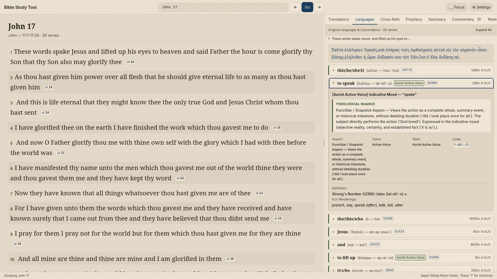
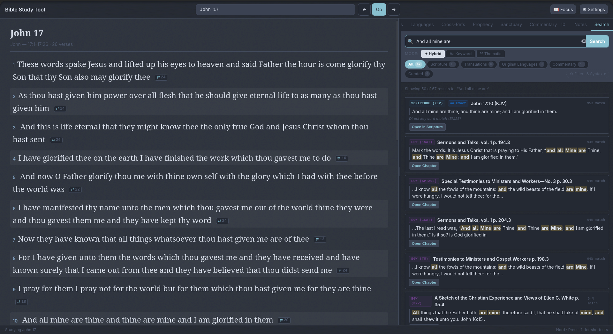
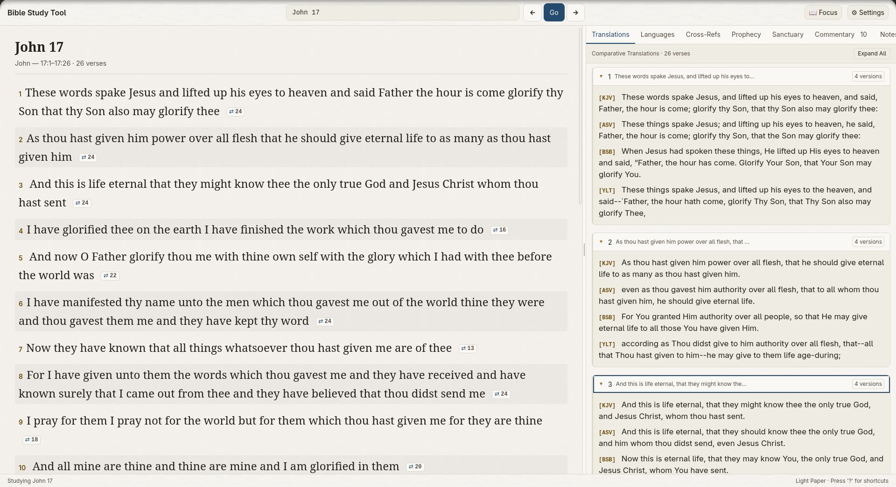
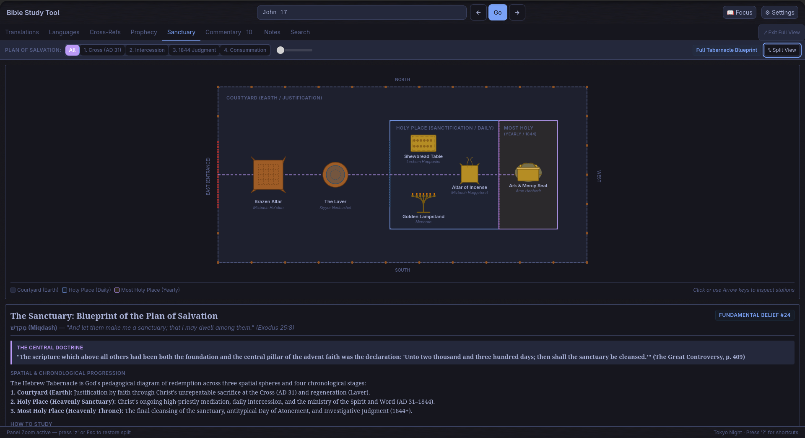
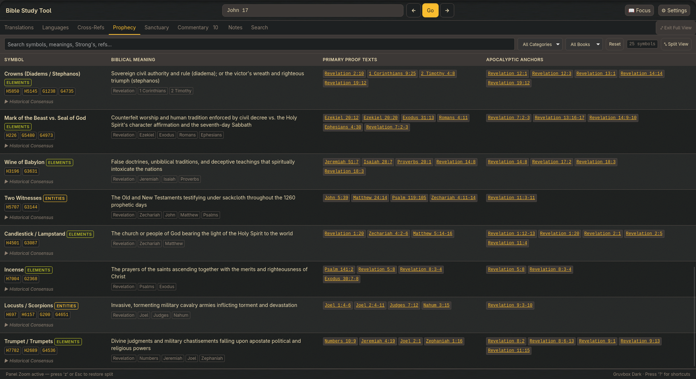
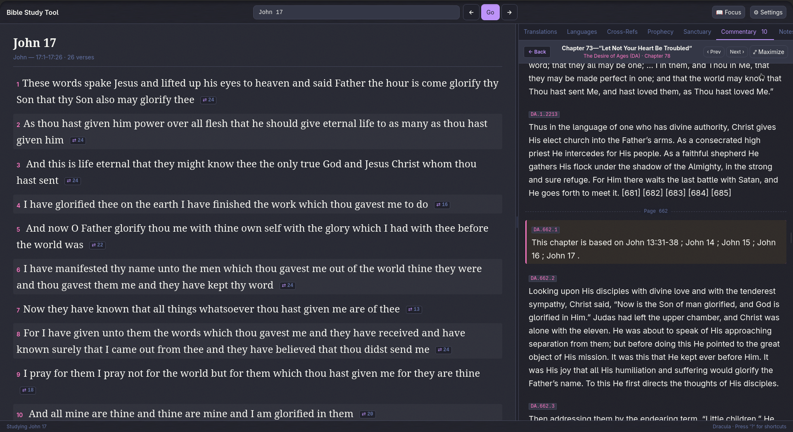

<div align="center">


# Adventist Bible Study Tool

**An interactive, zero-cloud biblical research workstation for deep inductive study.**  
Brings original Biblical Hebrew and Koine Greek into plain English, cross-references all 66 books with 344,000+ reciprocal links, and unifies Scripture, parallel translations, and historical commentary on a serene desktop study desk.

<p align="center">
  <a href="https://github.com/bible-study-tool/bible-study-tool/actions/workflows/ci.yml"></a>
  <a href="https://github.com/bible-study-tool/bible-study-tool/releases"></a>
  <a href="scripts/verify_all.sh"></a>
  <a href="docs/DOWNLOADS.md"></a>
  <a href="LICENSE"></a>
</p>

</div>

> 📖 **Quick Links**:
> - **Download Desktop App**: [Direct Downloads & Platform Packages](docs/DOWNLOADS.md) for macOS, Windows, and Linux.
> - **Visual Tour & Gallery**: Browse everyday workflows and layouts in the [Visual Tour](docs/VISUAL_TOUR.md).
> - **Study Tutorials**: Step-by-step inductive study guides in the [User & Study Guide](docs/USER_GUIDE.md) and [How to Study the Bible](docs/HOW_TO_STUDY_THE_BIBLE.md).

---

## What You Can Do With It

<p align="center">
  <a href="docs/VISUAL_TOUR.md"></a>
  <br>
  <em>The Study Room Desk in Warm Sepia: Scripture reading desk (left) alongside Original Languages &amp; Concordance inspector (right) unpacking Greek verbal aspect and theological nuance in plain English.</em>
</p>

```
┌────────────────────────────────────────────────────────────────────────────────────────┐
│  [ Genesis 1:1 ]   Translations: KJV │ ASV │ BSB │ YLT   [Search: /]   [Palettes: 10]  │
├─────────────────────────────────────────────────┬──────────────────────────────────────┤
│  SCRIPTURE READING DESK                         │ STUDY ROOM INSPECTOR                 │
│                                                 │                                      │
│  1 In the beginning God created the heaven and  │ [Languages] [TSK X-Refs] [Commentary]│
│    the earth.                                   │                                      │
│                                                 │ • בְּרֵאשִׁית (bərēʾšît) — H7225          │
│  2 And the earth was without form, and void;    │   Gloss: "in the beginning"          │
│    and darkness was upon the face of the deep.  │   Stem: Qal • Finite verbal action   │
│    And the Spirit of God moved upon the face    │                                      │
│    of the waters.                               │ • 344k Reciprocal Scripture Links    │
│                                                 │   ↳ John 1:1, Col 1:16, Heb 1:2      │
│  3 And God said, Let there be light: and there  │                                      │
│    was light.                                   │ • Sanctuary Blueprint Breadcrumb     │
│                                                 │   Courtyard ➔ Holy ➔ Most Holy Place │
└─────────────────────────────────────────────────┴──────────────────────────────────────┘
```

### The 9 Research Workstations

1. **Original Languages in Plain English**:
   - Understand theological nuances without seminary training.
   - Automatically parses Hebrew verbal stems (**Qal**, **Niphal**, **Piel**, **Hiphil**, **Hitpael**) and Greek verbal aspects/voices (**Aorist Active**, **Middle Voice**, **Perfect Passive**).
   - Maps apostolic argumentation through **Pauline Argument Flow** (`⟨Premise: γάρ⟩`, `⟨Therefore: οὖν⟩`, `⟨Purpose: ἵνα⟩`, `⟨Contrast: ἀλλά⟩`).
   - One-key jump (`o`) linking New Testament quotations directly to their Old Testament Hebrew and Septuagint (LXX) source passages.

2. **Unified & Hybrid Semantic Search Engine ([WP-039](docs/wp/WP-039-deterministic-cross-language-unified-search.md), [WP-040](docs/wp/WP-040-neural-embeddings-and-hybrid-search.md), [ADR-029](docs/decisions/ADR-029-zero-pytorch-local-neural-embeddings-and-hybrid-search.md)):**
   - Sub-millisecond, multi-database search across **all 31,102 verses** (KJV), parallel translations (ASV, BSB, YLT), Macula Hebrew & Greek morphology (815,000+ linguistic tokens), Ellen G. White commentary, and curated study notes.
   - **Tri-Brid Reciprocal Rank Fusion (RRF)**: Seamlessly blends SQLite FTS5 BM25 text rank, local dense vector cosine similarity, and Treasury of Scripture Knowledge (TSK) cross-reference graph into a single unified relevance score.
   - **Three Transparent Search Modes**:
     - `✦ Hybrid` *(Default)*: Blends direct keyword matches, semantic thematic parallels, and cross-references.
     - `Aa Keyword`: 100% deterministic SQLite FTS5 BM25 exact phrase and keyword search.
     - `☵ Thematic`: Pure local vector cosine similarity across 384-dimensional embeddings for conceptual discovery (e.g. *suffering servant*, *messianic sacrifice*, *covenant faithfulness*).
   - **Zero Cloud / Zero Generative Hallucinations**: Runs 100% offline on standard CPU via quantized ONNX (`multilingual-e5-small`). It is pure mathematical vector geometry over pinned Scripture, with zero generative AI chatbots, zero synthetic text fabrication, and zero telemetry.
   - **Bidirectional Query Expansion**: Searching English concepts (e.g. *covenant*, *sanctuary*, *atonement*) automatically discovers underlying Hebrew (*bərît* H1285) and Greek (*diathēkē* G1242) roots and semantic domains.
   - **Smart Omnibox Routing**: Entering a scripture reference (e.g. `John 3:16`, `Gen 1:1-3`) navigates the Scripture reading pane; keywords or Strong's codes auto-route to the Search workstation.
   - **Fine-Grained Filter Operators**: Search with `book:genesis`, `translation:bsb`, `strong:H7225`, `domain:sanctuary`, `egw:GC`, exact quotes (`"faith without works"`), or boolean operators (`AND`, `OR`, `NOT`).

3. **Whole-Bible Treasury of Scripture Knowledge (TSK)**:
   - Over **344,000 vote-ranked reciprocal cross-reference links** spanning all 66 books and 31,102 verses, embedded locally in SQLite (`data/bible.db`).
   - Instant reciprocal discovery: see every verse in the Bible that interprets or echoes the passage you are studying.

4. **Multi-Translation Parallel Reading Desk**:
   - Side-by-side or stacked comparative reading across 4 public-domain translations:
     - **King James Version (KJV 1769)** with Strong's number alignments.
     - **Berean Standard Bible (BSB 2020)**.
     - **American Standard Version (ASV 1901)**.
     - **Young's Literal Translation (YLT 1898)**.
   - Classical biblical typography with small-caps Tetragrammaton YHWH (`LORD` / `GOD`) and italicized supplied words.

5. **Interactive Sanctuary Typology Blueprint & Plan of Salvation**:
   - Interactive vector floorplan detailing the biblical sanctuary compartments (Courtyard, Holy Place, Most Holy Place), furniture, and sacrificial rituals.
   - Chronological **Plan of Salvation slider** traversing salvation history:
     $$\text{AD 31 Cross} \longrightarrow \text{Heavenly Inauguration} \longrightarrow \text{1844 Judgment} \longrightarrow \text{Second Coming} \longrightarrow \text{New Earth}$$
   - In-text verse badges linking theological doctrines directly to their sanctuary stations.

6. **Master Prophetic Key Table & Apocalyptic Symbol Chaining**:
   - Historicist apocalyptic symbol decoder for Daniel and Revelation.
   - Links apocalyptic beasts, horns, wings, waters, time periods (1,260 days, 2,300 evenings/mornings), and trumpets directly to their defining Old Testament keys and historical consensus citations.

7. **Spirit of Prophecy Progressive Narrative Reader**:
   - In-browser reading drawer with physical printed pagination fidelity matching the published books (e.g., `PP 44.1`, `DA 19.1`, `GC 623.2`).
   - Sequential chapter traversal (`‹ Prev / Next ›`) and direct canonical citation jumps.

8. **10 Study Room Color Palettes & Classical Typography**:
   - Designed for long, distraction-free study sessions without eye fatigue:
     - **Warm Palettes**: Warm Sepia, Dark Walnut (default Study Room Desk).
     - **Dark Themes**: Dracula, Catppuccin Mocha, Tokyo Night, Nord, Gruvbox Dark, Solarized Dark.
     - **Light Theme**: Clean archival parchment.
     - **Terminal Theme**: Transparent terminal pass-through mode.
   - Draggable 65/35 split-pane, Fullscreen Focus Mode (`f`), Panel Zoom (`z`), and WCAG AAA compliant contrast.

9. **Terminal Power Workstation (TUI Companion)**:
   - For keyboard-driven study and SSH sessions, a full-screen [Textual](https://textual.textualize.io/) terminal app (`bible-study --tui`) is built right in.
   - Instant sub-millisecond viewport switching, full keyboard navigation (`j`/`k`, `h`/`l`, `1`–`6` tabs, `v` translations, `t` themes, `?` help).

---

## Download & Install (Native Desktop App)

The desktop application is self-contained with zero external dependencies and zero terminal setup required:

| Platform | Package Format | Architecture | Download Link |
| :--- | :--- | :--- | :--- |
| **macOS** | `.dmg` Drag-and-Drop | Apple Silicon (M1/M2/M3/M4) | [**Download for macOS**](https://github.com/bible-study-tool/bible-study-tool/releases/latest) |
| **Windows** | `.exe` Setup / `.msi` | 64-bit Windows 10 & 11 | [**Download for Windows**](https://github.com/bible-study-tool/bible-study-tool/releases/latest) |
| **Linux** | `.AppImage` / `.deb` | 64-bit Linux Distributions | [**Download for Linux**](https://github.com/bible-study-tool/bible-study-tool/releases/latest) |
| **All Platforms** | Dedicated Downloads Portal | Detailed guides & checksums | [**Downloads Guide (docs/DOWNLOADS.md)**](docs/DOWNLOADS.md) |

> [!IMPORTANT]
> **macOS Note ("App is damaged and can't be opened"):**
> Because this is a free, non-profit community project built for Christian study, we do not pay Apple's $99/year commercial developer fee. If macOS Gatekeeper shows a warning dialog, either:
> 1. Go to **System Settings** ➔ **Privacy & Security** and click **"Open Anyway"**; OR
> 2. Open Terminal and run: `xattr -cr "/Applications/Adventist Bible Study.app"`
>
> *(See the [macOS Instructions](docs/DOWNLOADS.md#macos) for step-by-step guidance.)*

For detailed step-by-step instructions, see the [Downloads Guide](docs/DOWNLOADS.md) and [Installation Manual](docs/INSTALL.md).

---

## Workstation Tour & Screenshots

Explore the dedicated research workstations across different Study Room themes. *(For the complete visual walkthrough of all workstations and color palettes, see the [Visual Tour (docs/VISUAL_TOUR.md)](docs/VISUAL_TOUR.md).)*

### 1. Unified & Hybrid Semantic Search Engine (WP-039, WP-040)
*Instant multi-source retrieval blending keyword exact matches (BM25), dense neural embeddings (cosine similarity), and cross-references with transparent hit counts across Scripture, Translations, and Spirit of Prophecy commentary (shown in Nord theme).*

<p align="center">
  <a href="docs/VISUAL_TOUR.md#2-unified--hybrid-semantic-search-engine"></a>
</p>

### 2. Multi-Translation Parallel Reading Desk (v)
*Side-by-side or stacked comparative reading across KJV (with Strong's numbers), ASV, BSB, and YLT with classical biblical typography and small-caps divine names (shown in Light Paper theme).*

<p align="center">
  <a href="docs/VISUAL_TOUR.md#3-multi-translation-parallel-reading-desk"></a>
</p>

### 3. Interactive Sanctuary Typology Blueprint & Plan of Salvation (A13)
*Vector architectural floorplan traversing the Courtyard, Holy Place, and Most Holy Place across the 4-stage Plan of Salvation timeline slider: Cross (AD 31) ➔ Intercession ➔ 1844 Judgment ➔ Consummation (shown in Tokyo Night theme).*

<p align="center">
  <a href="docs/VISUAL_TOUR.md#4-interactive-sanctuary-typology-blueprint--plan-of-salvation"></a>
</p>

### 4. Master Prophetic Key Table & Apocalyptic Symbol Chaining (WP-031)
*Historicist apocalyptic symbol decoder linking Daniel and Revelation beasts, horns, waters, time periods, and trumpets to their Old Testament proof texts and historical consensus citations (shown in Gruvbox Dark theme).*

<p align="center">
  <a href="docs/VISUAL_TOUR.md#5-master-prophetic-key-table--apocalyptic-symbol-chaining"></a>
</p>

### 5. Spirit of Prophecy Progressive Narrative Reader (WP-033)
*In-browser narrative reading drawer with physical book pagination fidelity (e.g. DA 662.1, PP 44.1, GC 623.2), sequential chapter traversal, and direct citation jumps (shown in Dracula theme).*

<p align="center">
  <a href="docs/VISUAL_TOUR.md#6-spirit-of-prophecy-progressive-narrative-reader--correlations"></a>
</p>

> 🖼️ **Want to see more layouts and color palettes?**  
> Browse the [Visual Tour (docs/VISUAL_TOUR.md)](docs/VISUAL_TOUR.md) for Dark Walnut, Sepia, Focus Mode, terminal TUI screenshots, and keyboard shortcut demonstrations.

---

## For Developers & Power Users

### 1. Automated Clone & Bootstrap

```bash
git clone https://github.com/bible-study-tool/bible-study-tool.git
cd bible-study-tool

# One-command bootstrap (creates .venv, installs dependencies, hydrates SQLite databases, and verifies):
./bootstrap.sh --data --verify

# Activate the virtual environment:
source .venv/bin/activate
```

### 2. Launch the Application

```bash
# Launch the desktop web interface:
python -m search.ui.web
# (or with the installed CLI entrypoint: bible-study)
# (or run directly without activating: .venv/bin/python -m search.ui.web)

# Launch the interactive terminal TUI:
python scripts/study.py tui "John 1"
python scripts/study.py tui "Genesis 1"
```

### 3. Unified CLI Search & Linguistic Tools

```bash
# Unified cross-source search (Scripture + parallel translations + commentary):
python scripts/study.py search "covenant" --book genesis --limit 10

# Original-language lexicon lookup:
python scripts/study.py word H7225    # Hebrew: bereshit
python scripts/study.py word G3056    # Greek: logos

# Passagewise grammatical study cards:
python scripts/study.py study "John 1:1-5"

# Interactive study shell:
python scripts/study.py shell
```

### 4. Full Verification Suite

The repository enforces strict data integrity via 6 automated validators (F1–F6) and full test coverage:

```bash
bash scripts/verify_all.sh
```
*(Runs 929 unit and integration tests, F1–F6 schema/integrity validators, and raw source cryptographic checksum gates.)*

---

## Architectural Principles & Integrity

1. **Deterministic Core as the Source of Truth**:
   The primary knowledge base (Scripture text, parallel translations, Greek/Hebrew syntax trees, morphology, lexicons, cross-reference ledgers) is 100% deterministic, human-curated, and verified by cryptographic SHA-256 checksums. No AI or LLM has written, edited, or hallucinated any verse or note in the core ([correlations/DETERMINISTIC_VS_AI.md](correlations/DETERMINISTIC_VS_AI.md)).
2. **Local Mathematical Vector Retrieval (Zero Cloud / Zero Generative AI)**:
   The search engine provides dense neural embeddings running entirely offline on your CPU via quantized ONNX (`multilingual-e5-small`). It computes mathematical cosine similarity to surface thematic and conceptual parallels across passages, without calling external APIs or generating synthetic text. Users have full control to toggle between `✦ Hybrid`, `Aa Keyword` (pure deterministic BM25), and `☵ Thematic` modes at any time.
3. **Offline-First & Zero Telemetry**:
   All Scripture databases, lexicons, syntax trees, vectors, and commentary indexes reside locally on your machine. No telemetry, no usage tracking, no remote logging ([ADR-023](docs/decisions/ADR-023-zero-python-distribution-and-packaging.md)).
4. **Lightweight Distribution & On-Demand Library Indexing**:
   To keep desktop installer payloads lean and avoid multi-gigabyte PyTorch/model bloat, only the pre-computed Bible vector database is bundled (`data/embeddings.db`, 61.4 MB). Users who ingest external study materials (Spirit of Prophecy, personal study notes) can vectorize their library locally directly on-device in the background.
5. **Cryptographic Data Integrity ([ADR-027](docs/decisions/ADR-027-content-level-sqlite-integrity.md))**:
   All canonical SQLite databases (`bible.db`, `macula.db`) are validated with content-level SHA-256 projections (`data/INTEGRITY.json`) so they remain reproducible across different platforms, compilers, and architectures.

---

## Sourcing External Materials (What We Bundle & What You Supply)

We strictly follow the architectural policy: **"Link out, don't redistribute"** ([NOTICE.md](NOTICE.md), [ADR-002](docs/decisions/ADR-002-licensing-and-content-sourcing.md), [ADR-011](docs/decisions/ADR-011-whole-book-scaffolding-and-jit-egw.md)). This keeps the Git repository 100% license-clean under MIT and CC BY 4.0 while enabling powerful, offline, full-text research.

### What is bundled in the repository:
* **The Bible Text & TSK Cross-References**: All 66 books (31,102 verses) in local SQLite (`data/bible.db`) containing KJV (1769 with Strong's tags), BSB (2020), ASV (1901), YLT (1898), and 344k+ TSK cross-reference pairs.
* **Curated Corpus Entries**: Human-curated study entries for Genesis 1–3 and John 1 & 17 (`materials/bible/`), plus draft skeletons for Genesis 4–50.
* **Linguistic Data (Macula)**: Clear-Bible Macula Hebrew MT & Greek NT (Nestle 1904) Lowfat syntax trees, clause roles, and Louw-Nida semantic domains (`data/macula.db`).
* **Lexical Artifacts**: Strong's Hebrew & Greek lexicons, Brown-Driver-Briggs (BDB), Abbott-Smith Greek Lexicon, STEPBible TBESH/TBESG glosses, and the Genesis WordGraph.
* **Theological Schemas**: Historicist prophetic symbol table (`data/prophetic_lexicon.json`) and sanctuary typology blueprint (`data/sanctuary_schema.json`).

### What is NOT bundled (and how to supply it):
1. **Ellen G. White / Spirit of Prophecy Texts**:
   - *Why not bundled*: Works published after 1928 are protected under active copyright held by the Ellen G. White Estate.
   - *Official Online Research*: [egwwritings.org](https://m.egwwritings.org/). Public domain historical editions (prior to 1929) are available at the [Adventist Digital Library](https://adventistdigitallibrary.org/) and the [Internet Archive](https://archive.org/).
   - *How to use locally*: Repository entries store only canonical citation tokens (`egw:BOOK.PAGE.PARA`, e.g. `egw:PP.57.1`). If you have exported study passages in JSON format, ingest them locally with `python scripts/egw_lookup.py --ingest-json /path/to/passages.json`.
2. **Modern Copyrighted Translations**:
   - Modern translations (NIV, ESV, NASB, NKJV) belong to their respective publishers. Users supply personal translation files on-device; computations run strictly locally.
3. **Notice Regarding Scraping**:
   - This project does not ship automated bulk web scrapers for commercial or proprietary websites. Standardizing on canonical tokens honors copyright law while providing an offline research workstation.

---

## Documentation & Reference Index

| Document | Purpose |
| :--- | :--- |
| [Installation Guide](docs/INSTALL.md) | Step-by-step desktop setup for Windows, macOS, and Linux |
| [Visual Tour](docs/VISUAL_TOUR.md) | High-resolution screenshots of the workstation in everyday use |
| [User & Study Guide](docs/USER_GUIDE.md) | Practical study walkthroughs, features, and keyboard shortcuts |
| [How to Study the Bible](docs/HOW_TO_STUDY_THE_BIBLE.md) | Inductive Bible study methods, word studies, and sanctuary typology |
| [Architecture Decisions (ADRs)](docs/decisions/INDEX.md) | 29 formal architecture decision records (ADR-001 through ADR-029) |
| [Work Packages (WPs)](docs/wp/INDEX.md) | Tracked engineering milestones and delivered work packages (WP-001..040) |
| [Workflow & Engineering Guide](docs/WORKFLOW.md) | Engineering workflow, subagent reviews, and verification standards |
| [Tag Taxonomy](tags/taxonomy.json) | Controlled vocabulary for books, themes, and relationship types |
| [Roadmap](ROADMAP.md) | Living goal inventory, current progress, and sequenced milestones |

---

## License

This repository is dual-licensed by component:
- **Code** (the `search/` engine, scripts, and desktop app): [MIT License](LICENSE)
- **Original Content** (concordance data, semantic links, cross-references, taxonomies, and study notes): [Creative Commons Attribution 4.0 International (CC BY 4.0)](LICENSE.content)

See [NOTICE.md](NOTICE.md) for doctrinal foundations and content sourcing policies.
