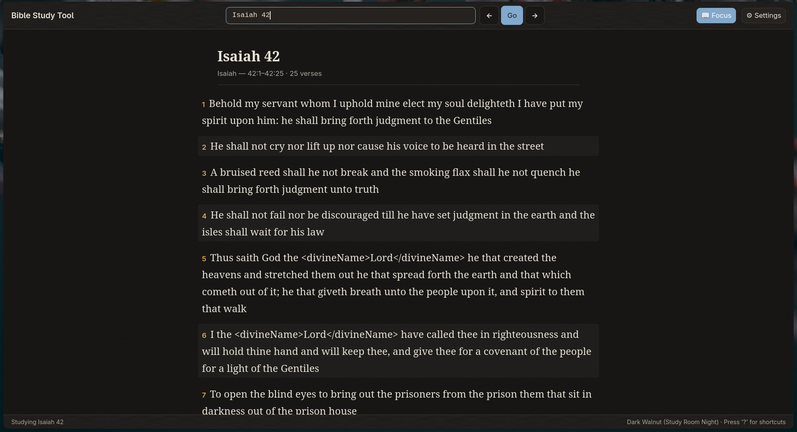
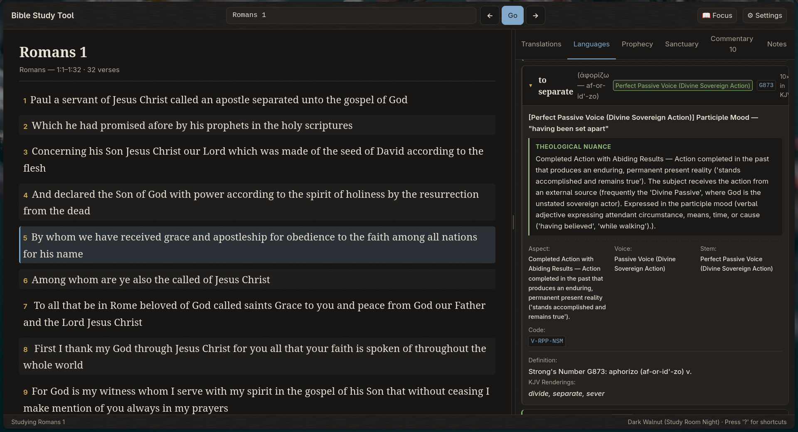
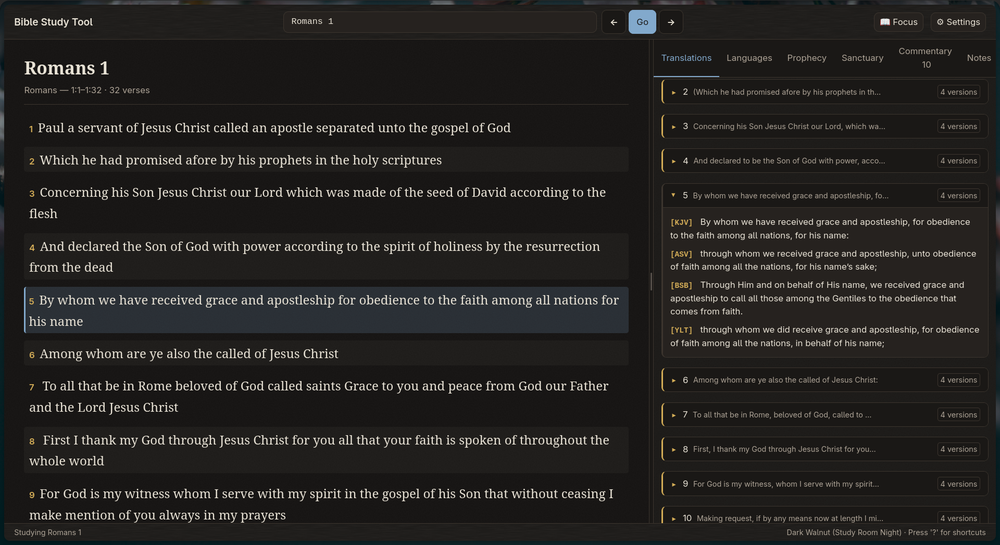
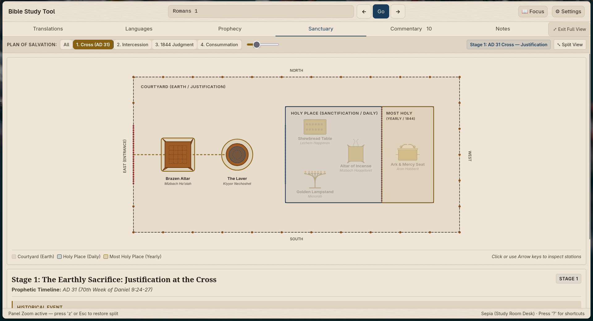

# User & Study Guide: Adventist Bible Study Tool

*A Friendly, Step-by-Step Guide for Personal Study, Small Groups, and Deeper Understanding — No Computer, Python, or Terminal Background Required*

---

## 1. Welcome & Biblical Purpose

> *"For what man knoweth the things of a man, save the spirit of man which is in him? even so the things of God knoweth no man, but the Spirit of God... comparing spiritual things with spiritual."*  
> — **1 Corinthians 2:11, 13**

Welcome! Whether you are opening the Scriptures for personal morning devotions, preparing a Sabbath School lesson, leading a small group Bible study, sharing truth with a neighbor, or preaching a sermon, this workstation was created for you.

You **do not need to be a programmer**, understand Python, or have any previous experience with a command line. The tool is designed to be as friendly, responsive, and distraction-free as an e-reader, while placing deep biblical research tools at your fingertips without the cost, complexity, or privacy concerns of commercial cloud software.

### What Makes This Tool Unique?
- **100% Offline & Private**: Runs entirely on your personal computer with zero internet dependency. It never transmits your studies, notes, or searches to external servers. Whether you are on an airplane, at a prayer retreat, or in a remote area without Wi-Fi, your complete study desk is always available.
- **Scripture Interpreting Scripture**: Built on the historic Protestant and Adventist principle that the Bible is its own best interpreter. It automatically reveals Old Testament roots behind New Testament passages and provides full-Bible cross-referencing.
- **Original Languages Made Plain**: You do not need to read Biblical Hebrew, Aramaic, or Koine Greek. The tool automatically decodes grammatical forms (verbal stems, voices, moods, and participant roles) into **clear, accessible English** and highlights their theological significance.
- **Sanctuary Typology & Prophecy**: Visualizes the earthly and heavenly sanctuaries with an interactive floorplan and a 4-stage chronological Plan of Salvation slider, paired with an Adventist historicist Prophetic Key Table.
- **Spirit of Prophecy Integration**: Seamlessly connects inspired commentary from Ellen G. White (*Patriarchs and Prophets*, *The Desire of Ages*, *The Great Controversy*, *Steps to Christ*, and more) directly alongside the biblical text, complete with progressive chapter reading and original book page citations.
- **Instant & Distraction-Free**: Zero advertisements, zero pop-ups, and sub-millisecond local response times.
- **Visual Tour**: See [VISUAL_TOUR.md](VISUAL_TOUR.md) for full-color screenshots of the interface in action.

---

## 2. Opening Your Study Desk in 60 Seconds

### For Non-Technical Users: Native Desktop App (Zero Python Required)

Getting started takes less than a minute with zero programming or terminal commands needed:

1. **Download** the desktop installer for your computer from the **[Downloads Portal](DOWNLOADS.md)** or [GitHub Releases](https://github.com/bible-study-tool/bible-study-tool/releases/latest):
   - **macOS**: `.dmg` drag-and-drop installer (Apple Silicon)
   - **Windows**: `.exe` setup installer or portable `.zip`
   - **Linux**: `.AppImage` or `.deb` package
2. **Launch** the application:
   - On macOS: Drag into `/Applications` and open (see [macOS opening guide](DOWNLOADS.md#macos)).
   - On Windows: Run the setup wizard and launch from Start Menu.
   - On Linux: Run the `.AppImage` or install `.deb`.
3. Your local study desk opens immediately in its own native desktop window.

On your very first launch, the built-in **Setup Wizard** automatically verifies the cryptographic integrity of your Scripture databases and lexicons (via `data/INTEGRITY.json`), helps you pick your preferred visual reading theme, and introduces key workstation features.

For detailed operating-system-specific installation steps, desktop shortcuts, and troubleshooting, see [INSTALL.md](INSTALL.md) and [DOWNLOADS.md](DOWNLOADS.md).

---

### For Developers & Power Users (Command Line & TUI)

If you are running directly from the Git repository or prefer working inside a terminal emulator:

```bash
# Launch the primary local web workstation (opens browser at http://localhost:8000)
bible-study
# or directly from source:
python -m search.ui.web

# Or launch the interactive Terminal User Interface (TUI companion)
bible-study --tui
# or directly from source:
python scripts/study.py tui "John 1:1-18"

# Open the TUI directly to any passage
python scripts/study.py tui "Genesis 1:1-2:3"
python scripts/study.py tui "Romans 1:16-17"
```

---

## 3. Understanding the Workstation Layout

The workstation is built around a balanced, ergonomic two-pane study desk:

```
┌──────────────────────────────────────────────┬─┬──────────────────────────────────────────┐
│  📖 SCRIPTURE READING PANE (65% Default)     │ │  🔍 STUDY PANELS (35% Default)           │
├──────────────────────────────────────────────┤ ├──────────────────────────────────────────┤
│  [← Prev Ch]   John 1:1-18      [Next Ch →]  │ │ [Translations][Languages][Cross-Refs]    │
│  Search / Jump: [ John 1:14                ] │ │ [Prophecy][Sanctuary][Commentary][Notes] │
├──────────────────────────────────────────────┤D├──────────────────────────────────────────┤
│                                              │I│  ORIGINAL LANGUAGE NUANCE (Languages)    │
│  John 1:14                                   │V│  • ἐγένετο (G1096) — Aorist Middle       │
│  And the Word was made flesh, and            │I│    "Came into being / became"            │
│  dwelt among us, (and we beheld              │D│    The eternal Word took human nature    │
│  his glory, the glory as of the              │E│                                          │
│  only begotten of the Father,) full          │R│  • ἐσκήνωσεν (G4637) — Aorist Active     │
│  of grace and truth.                         │ │    "Tabernacled / pitched tent"          │
│  ⟨OT Anchor: Exodus 34:6⟩                    │ │    Sanctuary presence among humanity     │
│                                              │ │                                          │
│  John 1:15                                   │ │  SANCTUARY TYPOLOGY (Sanctuary Tab)      │
│  John bare witness of him, and cried...      │ │  Station: Courtyard → Altar / Laver      │
└──────────────────────────────────────────────┴─┴──────────────────────────────────────────┘
```

### The Left Pane: Scripture Reading Desk
- **Continuous Passage Reading**: Reads biblical chapters in clear, elegant typography with adjustable fonts and contrast.
- **Active Verse Selection**: The active verse is clearly highlighted with a distinct border. Navigating with `j` / `k` (or arrow keys) instantly synchronizes all research panels on the right.
- **Inline Badges**:
  - `⟨OT Anchor: ...⟩`: Identifies direct Old Testament quotations and allusions.
  - `⟨Premise: γάρ⟩`, `⟨Therefore: οὖν⟩`, `⟨Purpose: ἵνα⟩`: Highlights apostolic argument connectors.
  - `⟨Prophecy: ...⟩`: Badges apocalyptic symbols linked to the Prophetic Key Table.
- **Focus Mode (`f`)**: Need uninterrupted devotional time? Press `f` to hide all study panels and expand the Scripture reader to the full width of your screen. Press `f` or `Esc` anytime to bring the study panels back.


*Scripture Reader in Focus Mode (`f`), providing distraction-free reading.*

### The Center Divider: Draggable Split-Pane
- **Custom Split**: Click and drag the vertical divider handle horizontally to adjust the width between reading and research.
- **Double-Click Reset**: Double-click the divider handle at any time to snap back to the default 65% reading / 35% study panel balance.

### The Right Pane: 7 Dedicated Study Tabs
The study side-pane provides 7 deep research panels:
1. **Translations**: Parallel comparison of four trusted versions (KJV, ASV, BSB, YLT) with side-by-side verse cards and stacked alignment.
2. **Languages**: Plain-English Hebrew, Aramaic, and Greek grammar nuances, verbal stems (Qal, Niphal, Piel, etc.), voices, moods, and participant roles.
3. **Cross-Refs**: Interactive cross-reference explorer with Layer A curated theological links and Layer B Treasury of Scripture Knowledge (~345,000 links) with instantaneous keyword filtering.
4. **Prophecy**: Master Prophetic Key Table featuring 30+ biblical symbols with verified scriptural definitions, Day-Year principles, and historicist prophetic chains.
5. **Sanctuary**: Interactive vector blueprint floorplan of the Hebrew Sanctuary and a 4-stage Plan of Salvation chronological slider (Cross AD 31 → Intercession → 1844 Investigative Judgment → Consummation).
6. **Commentary**: Progressive Spirit of Prophecy chapter reader and per-verse commentary extracts from Ellen G. White's Conflict of the Ages series and devotional works.
7. **Notes**: Personal study notes and topical annotations.

**Panel Zoom (`z` or `Shift+F`)**: Want to examine the Sanctuary blueprint or read an entire chapter of *The Desire of Ages* across your whole screen? Press `z`, `Shift+F`, or double-click any tab header to maximize the study panel to full window width. Press `Esc` or click **⤢ Exit Full View** to return.

---

## 4. The 8 Core Comprehension Tools

The workstation equips you with eight specialized study tools designed to unlock deeper understanding:

---

### Tool 1: Plain-English Hebrew & Greek Nuances (Languages Tab)

Ancient biblical languages often communicate shades of meaning that single English words cannot convey. The workstation automatically translates grammatical forms into **plain English** and explains their theological weight:

- **Hebrew Verb Stems**:
  - *Qal*: Simple, active reality (e.g. "He created").
  - *Niphal*: Passive or reflexive action (e.g. "It was revealed").
  - *Piel*: Intensive or transformative action (e.g. Genesis 2:3 — God actively *set apart and sanctified* the seventh day as holy).
  - *Hiphil*: Causative action (e.g. God *causes* righteousness to spring forth).
  - *Hitpael*: Reflexive, habitual intimate communion (e.g. Enoch *walked habitually in close fellowship with God*).
- **Greek Voices & Tenses**:
  - *Aorist*: A decisive, accomplished historical fact (e.g. John 1:14 — "The Word *became* flesh").
  - *Present*: Continuous, ongoing, moment-by-moment Christian walk.
  - *Perfect*: An action completed in the past with enduring, permanent present results (e.g. Romans 1:1 — Paul *having been permanently set apart* unto the gospel).
  - *Middle Voice*: Deep personal interest and affectionate involvement (e.g. Ephesians 1:4 — God chose us *for Himself* out of boundless love).


*Tab 2 (Languages / Syntax) displaying grammatical breakdown and theological nuance for the active verse.*

---

### Tool 2: Pauline Argument Flow & Discourse Markers

When writing his epistles, the apostle Paul constructed rigorous, step-by-step logical arguments. The workstation tags these inspired logical connectors with clear inline badges:

- `⟨Premise: γάρ⟩` (*gar* = "For / Because"): Introduces the divine reason or doctrinal foundation.
- `⟨Therefore: οὖν⟩` (*oun* = "Therefore / Consequently"): Marks the practical application — because God has done this, how then shall we live?
- `⟨Purpose: ἵνα⟩` (*hina* = "In order that / With the aim that"): Reveals God's ultimate purpose in redemption.
- `⟨Contrast: ἀλλά⟩` (*alla* = "Yet / But on the contrary"): Highlights the stark contrast between human weakness and divine grace.

*Study Example*: Examine Romans 1:15–18. Notice how Paul chains his thoughts with premise markers: "I am ready to preach the gospel... **FOR** I am not ashamed... **FOR** it is the power of God... **FOR** therein is the righteousness of God revealed... **FOR** the wrath of God is revealed." You can trace the Holy Spirit's inspired train of reasoning!

---

### Tool 3: Scripture Interpreting Scripture: OT Citation Anchors

The New Testament writers constantly anchored their teachings in the Hebrew Scriptures.
- Whenever a verse quotes or directly echoes an Old Testament passage, you will see a badge such as `⟨OT Anchor: Habakkuk 2:4⟩` (on Romans 1:17) or `⟨OT Anchor: Exodus 34:6⟩` (on John 1:14).
- **Click the badge** or press **`o`** on your keyboard: The workstation leaps directly to the Old Testament source passage.
- Inspect the Hebrew wording, the ancient Greek Septuagint translation, and the covenant context.
- **Press `o` again** to return immediately to your New Testament reading passage.

---

### Tool 4: Multi-Translation Parallel Reading (Translations Tab & Key `v`)

Comparing reliable translations is one of the most effective ways to discern the nuances of Scripture.
- **Press `v`** while reading any chapter: The workstation immediately expands the reading pane to show color-coded, stacked parallel lines for each verse:
  - **KJV** (King James Version 1769): Pinned historical text with inline Strong's concordance numbers.
  - **BSB** (Berean Standard Bible 2020): Modern, accurate, and highly readable English.
  - **ASV** (American Standard Version 1901): Renowned for close word-for-word grammatical fidelity.
  - **YLT** (Young's Literal Translation 1898): Strict literal rendering preserving original Hebrew and Greek verb tenses.
- Press `v` again to return to single-column reading, or select **Tab 1 (`Translations`)** in the side-pane for side-by-side comparison cards for the active verse.


*Parallel Translations comparison stack (KJV, ASV, BSB, YLT) in Dark Walnut theme.*

---

### Tool 5: Interactive Whole-Bible Cross-References & TSK (Cross-Refs Tab & Key `x`)

Explore the interconnected tapestry of Scripture with an exhaustive cross-reference engine:
- **Layer A (Curated SDA Theological Correlations)**: Essential doctrinal and thematic links verified by biblical scholars.
- **Layer B (Treasury of Scripture Knowledge — ~345,000 Links)**: The classic, comprehensive whole-Bible cross-reference network covering every book and chapter of the Old and New Testaments.
- **Instant Keyword Filter**: Type in the filter box (e.g. `"covenant"`, `"sabbath"`, `"remnant"`, `"blood"`, `"rest"`) to instantly isolate the exact thematic thread you are studying.
- **Quick Jump & Preview**: Click any cross-reference card to preview the full verse text or navigate directly to that chapter.

---

### Tool 6: Interactive Sanctuary Blueprint & Plan of Salvation (Sanctuary Tab)

The Sanctuary is the grand visual model of the entire Plan of Salvation (Psalm 77:13: *"Thy way, O God, is in the sanctuary"*).
- **Interactive Vector Floorplan**: Visually explore each compartment and sacred furniture piece:
  - **Courtyard**: Altar of Burnt Offering (Sacrifice / Justification) and the Bronze Laver (Cleansing / Regeneration).
  - **Holy Place**: Table of Shewbread (Word of God), Seven-Branched Lampstand (Holy Spirit / Witness), and Altar of Incense (Continual Prayers of Christ).
  - **Most Holy Place**: Ark of the Covenant, Ten Commandments (Moral Foundation), and Mercy Seat (Throne of Grace and Atonement).
- **4-Stage Chronological Slider**: Drag or click the slider to walk through salvation history:
  1. *1. Cross (AD 31)* — **Justification**: The Lamb of God slain for the sins of the world.
  2. *2. Heavenly Intercession (AD 31–1844)* — **Sanctification**: Christ our High Priest ministering in the Holy Place of the heavenly sanctuary.
  3. *3. Investigative Judgment (1844–Close of Probation)* — **Cleansing of the Sanctuary**: Christ enters the Most Holy Place for the final Day of Atonement judgment (Daniel 8:14, Leviticus 16, Revelation 14:6–7).
  4. *4. Consummation / New Earth* — **Eternal Restoration**: The sanctuary cleansed, sin eradicated, and God tabernacling forever with His redeemed people (Revelation 21:3).


*Interactive Sanctuary Blueprint floorplan with the 4-stage Plan of Salvation slider.*

---

### Tool 7: Master Prophetic Key Table & Symbol Chaining (Prophecy Tab)

Daniel and Revelation use symbolic language that the Bible itself interprets:
- **30+ Apocalyptic Symbols**: Access a master dictionary of biblical prophetic symbols (Horn, Beast, Waters, Day, Woman, Wind, Rock, Wings, etc.).
- **Verified Scriptural Keys**: Every symbol definition is proven by direct Scripture (e.g. *Waters* = Multitudes, peoples, and nations per Revelation 17:15; *Beast* = Kingdom or political power per Daniel 7:23; *Day* = Literal year per Numbers 14:34 and Ezekiel 4:6).
- **Historicist Consensus**: Clear doctrinal grounding reflecting the historicist prophetic interpretation of Daniel 2, 7, 8, 9, 11, and Revelation 12–14.
- **Inline Text Badges**: Click any prophecy badge directly in the Scripture reader to pull up the symbol's verified definition and cross-references without leaving your reading flow.

---

### Tool 8: Progressive Spirit of Prophecy Chapter Reader (Commentary Tab & Key `c`)

Connect the inspired commentary of Ellen G. White to your biblical exegesis:
- **Per-Verse Commentary**: Selecting any verse loads verified commentary paragraphs from Ellen G. White's writings (e.g. *Patriarchs and Prophets*, *The Desire of Ages*, *The Great Controversy*, *Christ's Object Lessons*).
- **Direct Citation Token Goto (`g`)**: Jump straight to any specific paragraph in the Spirit of Prophecy corpus using standard tokens (e.g. `DA 19.1`, `PP 44.1`, `GC 678.1`, `SC 62.2`).
- **Progressive Chapter Reader**: Toggle the continuous chapter reader mode to read whole chapters of Ellen G. White's books with authentic page break indicators, allowing you to follow her complete thematic narrative.

---

## 5. Step-by-Step Study & Teaching Walkthroughs

### Walkthrough 1: The Incarnation & Sanctuary Presence (John 1:14)
*Goal: Discover the deep sanctuary meaning of "The Word Dwelt Among Us" for personal devotion, Bible study, or a sermon.*

1. **Open the passage**: Type `John 1:14` in the search/goto box (or press `g`).
2. **Select verse 14**: Click verse 14 or use `j` / `k` until it is highlighted.
3. **Inspect Original Language Nuances (Languages Tab)**:
   - Select `ἐσκήνωσεν` (*eskēnōsen*): Derived from *skēnoō*, literally meaning "to pitch a tent or tabernacle."
   - *Spiritual Insight*: Jesus did not visit our world as an aloof spectator; He pitched His human tent in our neighborhood. Just as the Shekinah glory filled the desert tabernacle (Exodus 40:34), God's glory tabernacled in human flesh.
4. **Notice the Old Testament Sanctuary Connection**:
   - The phrase "full of grace and truth" translates *plērēs charitos kai alētheias*.
   - Look at the `⟨OT Anchor: Exodus 34:6⟩` badge. Click it (or press `o`).
   - Notice that this is the exact Greek translation of the Hebrew *rav chesed ve-’emet* ("abundant in steadfast love and faithfulness") from Exodus 34:6, when the LORD revealed His character to Moses on Mount Sinai.
   - *Insight*: In Christ, God's Sinai covenant character is revealed not on cold stone tablets, but in a living, loving human life. Press `o` to return.
5. **Connect to the Sanctuary Blueprint (Sanctuary Tab)**:
   - Switch to the **Sanctuary** tab.
   - Observe the Courtyard: The Incarnation brings God down to the realm of humanity, where the Lamb of God would be offered on the Altar of Burnt Offering.
6. **Read the Spirit of Prophecy Commentary (Commentary Tab)**:
   - Open the **Commentary** tab and read from *The Desire of Ages*, Chapter 1 ("God With Us"):
     > *"By coming to dwell with us, Jesus was to reveal God both to men and to angels... His name shall be called Emmanuel, 'God with us.'"* (DA 19.1)
7. **Compare Translations (Press `v`)**:
   - Compare KJV "dwelt among us" with BSB and YLT "tabernacled among us."

---

### Walkthrough 2: The Righteousness of Faith (Romans 1:16–17)
*Goal: Follow Paul's train of thought on "The Just Shall Live by Faith" and connect it to Habakkuk 2:4.*

1. **Open Romans 1**: Navigate to `Romans 1:16`.
2. **Trace the Argument Flow**:
   - Notice the `⟨Premise: γάρ⟩` markers linking verse 15 to verse 16 to verse 17:
     - v15: Ready to preach the gospel...
     - v16: **FOR** it is the power of God unto salvation...
     - v17: **FOR** therein is the righteousness of God revealed...
3. **Jump to the Old Testament Source (Press `o`)**:
   - On verse 17, locate the badge `⟨OT Anchor: Habakkuk 2:4⟩`.
   - Press `o` (or click the badge). The workstation instantly jumps to Habakkuk 2:4 ("the just shall live by his faith").
   - Inspect the Hebrew noun *’ĕmûnāh* (H0530): Biblical faith is not mere intellectual assent, but active, loyal steadfastness and covenant fidelity amidst a collapsing world.
   - Press `o` to return to Romans 1:17.

---

### Walkthrough 3: Christ’s High Priestly Prayer (John 17:1–5, 21–23)
*Goal: Study Jesus' High Priestly intercession, His eternal divinity, and His longing for the unity of His church.*

1. **Open John 17**: Navigate to `John 17:1`.
2. **Examine the High Priestly Prayer**:
   - Verse 1: "Father, the hour is come; glorify thy Son..."
   - Open the **Languages** tab: The Aorist active imperative `δόξασον` (*doxason*) reveals Jesus speaking with holy confidence as our High Priest preparing to seal the covenant with His blood.
3. **Inspect Experiential Knowledge in Verse 3**:
   - Select verse 3: "And this is life eternal, that they might know thee..."
   - Inspect `ginōskō` (G1097): This knowledge is not intellectual theory, but deep, relational covenant communion.
4. **Trace Believer Unity in Verses 21–23**:
   - Select verse 21: "That they all may be one; as thou, Father, art in me, and I in thee."
   - The **Languages** tab highlights the divine purpose clause `⟨Purpose: ἵνα⟩`: Believer unity is the ultimate proof that convinces the world of God's redeeming love.
5. **Read Spirit of Prophecy Commentary**:
   - Switch to the **Commentary** tab to read *The Desire of Ages*, Chapter 73 ("Let Not Your Heart Be Troubled").

---

### Walkthrough 4: Prophetic Time & The Sanctuary Blueprint (Daniel 8:14 & Hebrews 9)
*Goal: Understand the cleansing of the sanctuary, the 2,300-day prophecy, and Christ’s final Day of Atonement ministry.*

1. **Open Daniel 8:14**: Navigate to `Daniel 8:14` ("Unto two thousand and three hundred days; then shall the sanctuary be cleansed").
2. **Examine the Prophecy Tab**:
   - Switch to the **Prophecy** tab.
   - Review the **Day-Year Principle** key: Numbers 14:34 and Ezekiel 4:6 establish that in symbolic apocalyptic time, a prophetic day equals one solar year.
   - Trace the 2,300 prophetic years starting from the decree to restore and rebuild Jerusalem in 457 BC (Ezra 7, Daniel 9:25) reaching to 1844 AD.
3. **Open the Sanctuary Tab**:
   - Switch to the **Sanctuary** tab.
   - Move the chronological slider to **Stage 3: 1844 — Investigative Judgment (Cleansing of the Sanctuary)**.
   - Notice how the focus shifts into the **Most Holy Place** before the Ark of the Covenant and the Mercy Seat.
   - Inspect the theological note: In 1844, at the close of the 2,300 days, Christ entered the Most Holy Place to begin the final work of investigative judgment and atonement before His second coming.
4. **Correlate with Hebrews 9**:
   - Type `Hebrews 9:11-12, 23-24` in the search box to see how the earthly sanctuary was an illustration of the greater and more perfect heavenly tabernacle.
5. **Read *The Great Controversy***:
   - Switch to the **Commentary** tab and enter token `GC 409.1` (Chapter 23: "What Is the Sanctuary?") and `GC 423.1` (Chapter 24: "In the Holy of Holies").

---

### Walkthrough 5: Tracing a Whole-Bible Theme with TSK (Genesis 2:1–3)
*Goal: Trace the Sabbath rest from Eden through Sinai, the prophets, and into Hebrews 4 using Whole-Bible Cross-References.*

1. **Open Genesis 2:1–3**: Navigate to `Genesis 2:1`.
2. **Inspect the Hebrew Verb in Verse 3 (Languages Tab)**:
   - Notice *qādash* (H6942) in the Piel stem: God intensively sanctified and set apart the seventh day before sin ever entered the world.
3. **Open Cross-Refs Tab (Key `x`)**:
   - Switch to the **Cross-Refs** tab.
   - In the filter input, type `"sabbath"`.
   - Instantly view cross-references connecting Genesis 2:2–3 to:
     - **Exodus 20:8–11**: The 4th Commandment pointing directly back to the Creation week ("For in six days the LORD made heaven and earth...").
     - **Exodus 31:13–17**: The Sabbath as an enduring sign of sanctification between God and His people.
     - **Isaiah 58:13–14**: The call to delight in the holy of the LORD and repair the breach.
     - **Hebrews 4:4, 9–10**: The remaining Sabbath rest (*sabbatismos*) for the people of God, resting in Christ's finished work.
4. **Click any reference card** to jump directly to that passage and continue your chain study.

---

## 6. Keyboard & Mouse Quick Reference

### Web Workstation Shortcuts

| Key / Action | Function | Description |
|:---|:---|:---|
| `j` or `↓` | Next Verse | Advance down one verse in the reading pane |
| `k` or `↑` | Previous Verse | Move up one verse in the reading pane |
| `h` or `p` or `[` or `←` | Previous Chapter | Navigate to the previous chapter |
| `l` or `n` or `]` or `→` | Next Chapter | Navigate to the next chapter |
| `Space` or `Enter` | Pin / Select Verse | Pin the selected verse and sync research panels |
| `g` or `/` or `Ctrl+P` | Search / Jump | Focus the search and passage navigation box |
| `f` | Focus Mode | Toggle full-width distraction-free Scripture reading |
| `z` or `Shift+F` | Panel Zoom | Maximize active research panel to full window width |
| `v` | Parallel Translations | Toggle 4-translation stacked alignment under each verse |
| `s` | Toggle Strong's | Display or hide inline Strong's concordance tags |
| `o` | Jump OT Anchor | Jump directly to Old Testament source quotation and back |
| `1` | Tab 1: Translations | Switch study panel to parallel translation cards |
| `2` | Tab 2: Languages | Switch study panel to Greek/Hebrew syntax and nuances |
| `3` or `x` | Tab 3: Cross-Refs | Switch study panel to Curated & TSK cross-references |
| `4` | Tab 4: Prophecy | Switch study panel to Master Prophetic Key Table |
| `5` | Tab 5: Sanctuary | Switch study panel to Sanctuary blueprint and slider |
| `6` or `c` | Tab 6: Commentary | Switch study panel to Ellen G. White commentary |
| `7` | Tab 7: Notes | Switch study panel to personal study notes |
| `t` | Cycle Theme | Switch between reading color palettes |
| `?` | Shortcuts Modal | Display interactive keyboard shortcut cheat sheet |
| `Esc` | Dismiss / Close | Close open modals, exit Focus/Zoom modes, or dismiss cards |

### Mouse & Touch Controls
- **Click any verse**: Selects that verse and synchronizes all active study panels.
- **Drag center divider**: Adjusts the proportion between the reading pane and study panels.
- **Double-click center divider**: Snaps the split back to the default 65/35 balance.
- **Double-click any tab header**: Toggles full-width panel zoom for that tool.
- **Click inline badges**: Leaps to OT sources or opens prophetic symbol definitions.

---

### Terminal Companion (TUI) Shortcuts
For users operating inside a terminal emulator via `bible-study --tui` or `python scripts/study.py tui`:

| Key | Tab / Action |
|:---:|:---|
| `1` | Syntax & Grammatical Frames |
| `2` | Lexicon & Strong's Dictionary |
| `3` | Commentary (Ellen G. White) |
| `4` | Parallel Translations (KJV, ASV, BSB, YLT) |
| `5` | Search & Concordance Findings |
| `6` or `x` | Whole-Bible Cross-References (TSK) |
| `c` | Toggle Continuous EGW Chapter Reader vs Per-Verse View |
| `q` | Quit the application |

---

## 7. Selecting Your Favorite Theme

Everyone’s eyes, lighting conditions, and aesthetic preferences are different. You can switch visual themes anytime by pressing **`t`** or choosing from the **Visual Theme** dropdown in Settings:

### Web Workstation Themes
1. **Sepia (Study Room Desk)** *(Default)*: A warm parchment background with deep indigo, gold, and olive accents. Designed specifically for low glare and extended, comfortable reading sessions.
2. **Light Paper**: A clean, modern daylight paper tone offering crisp contrast for bright rooms.
3. **Dark Walnut (Study Room Night)**: A rich walnut-charcoal background with warm amber text, ideal for evening and nighttime study.

### Terminal Companion (TUI) Palettes
The terminal interface supports 7 high-contrast terminal palettes:
1. **Transparent** *(Default)*: Uses your native terminal window’s background and transparency.
2. **Dracula**: Dark palette with vibrant purple, pink, and cyan accents.
3. **Catppuccin Mocha**: Soothing pastel colors designed for reduced eye strain.
4. **Tokyo Night**: Deep blue and neon dark palette.
5. **Nord**: Cool Arctic blues and slate grays.
6. **Gruvbox Dark**: Warm, retro earthy tones.
7. **Solarized Dark**: Precision-engineered color values for optimal legibility.

---

## 8. Summary: Scripture in Your Hands

Ellen G. White wrote in *Christ’s Object Lessons*:

> *"The Bible is its own expositor. Scripture is to be compared with scripture. The student should learn to view the word as a whole, and to see the relation of its parts. He should gain a knowledge of its grand central theme, of God’s original purpose for the world, of the rise of the great controversy, and of the work of redemption."*  
> — **COL 128.1**

May this tool be a joyful blessing as you search the living, inspired Scriptures!

---

### Further Reading & Resources
- **[Visual Tour (VISUAL_TOUR.md)](VISUAL_TOUR.md)**: Full-color screenshots of Focus Mode, Syntax inspector, Parallel translations, and the Sanctuary blueprint.
- **[Installation Guide (INSTALL.md)](INSTALL.md)**: Standalone zero-Python desktop application downloads and setup troubleshooting.
- **[How to Study the Bible Deeply (HOW_TO_STUDY_THE_BIBLE.md)](HOW_TO_STUDY_THE_BIBLE.md)**: Foundational Adventist study methodology — inductive reading, word studies, thematic chaining, and sanctuary typology.
