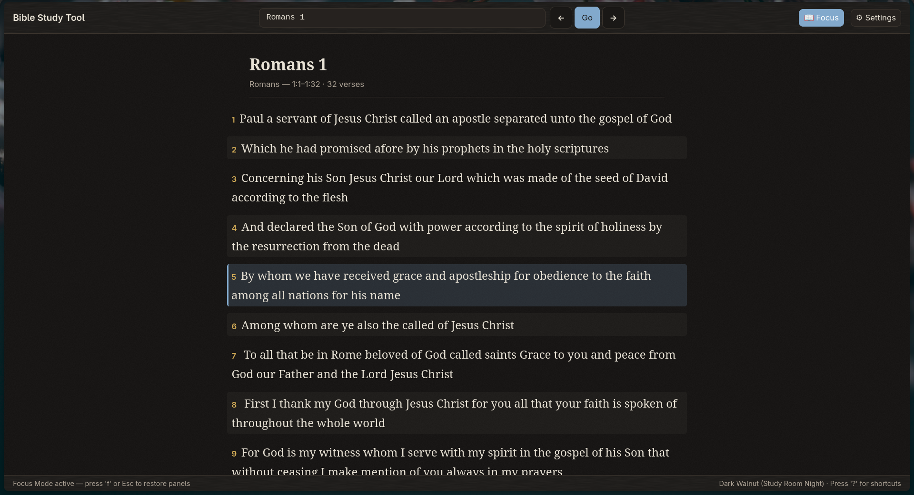
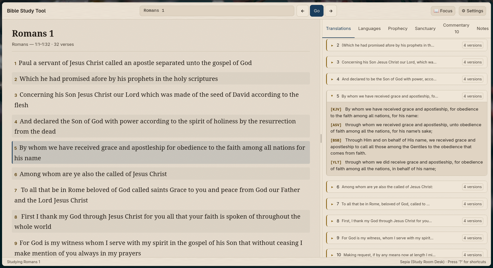

# Visual Tour — Adventist Bible Study Tool

Screenshots of the workstation in everyday use. Dark Walnut is the default reading theme; Sepia is a warmer, low-glare alternative (cycle with `t`).

---

## Focus Mode — distraction-free reading

**Focus Mode** (`f`) hides the Study Inspector and expands the Scripture Reader to full width — ideal for long passages and devotional reading.

*Isaiah 42, Dark Walnut theme, Focus Mode (inspector hidden).*

*Romans 1, Dark Walnut theme. Status bar reads "Focus Mode active — press 'f' or Esc to restore panels."*

---

## Tab 1 — Syntax, verbal stems & theological nuance

The Study Inspector on Tab 1 breaks down original-language forms into plain English — verbal stems, voices, moods, and theological nuances for the active verse.

*Romans 1:5, Dark Walnut. Inspector shows ἀφορίζω (G873, Perfect Passive Voice) with plain-English gloss "having been set apart" and theological nuance.*

---

## Tab 4 — Parallel translations

**`v`** (or Tab 4) stacks KJV, BSB, ASV, and YLT side-by-side for the selected verse.

*Romans 1:5, Dark Walnut — KJV / ASV / BSB / YLT stacked.*

*Same passage in the Sepia theme (warm, low-glare).*

---

## Sanctuary blueprint (Plan of Salvation)

The interactive sanctuary typology workstation (A13): traverse the Courtyard / Holy Place / Most Holy Place by prophetic stage (Cross → Intercession → 1844 Judgment → Consummation).

*Plan of Salvation, stage "1. Cross (AD 31) — Justification," Sepia theme. Inspect stations with arrow keys or click.*

---

## Themes

Cycle all 7 themes with `t`: Transparent, Dracula, Catppuccin Mocha, Tokyo Night, Nord, Gruvbox Dark, Solarized Dark. The two shown here are Dark Walnut (default) and Sepia.
