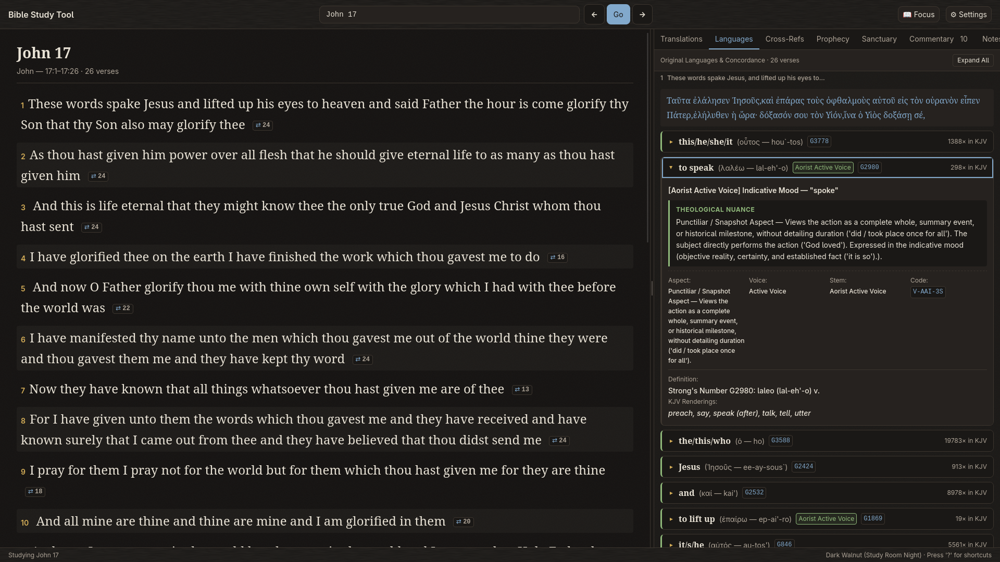
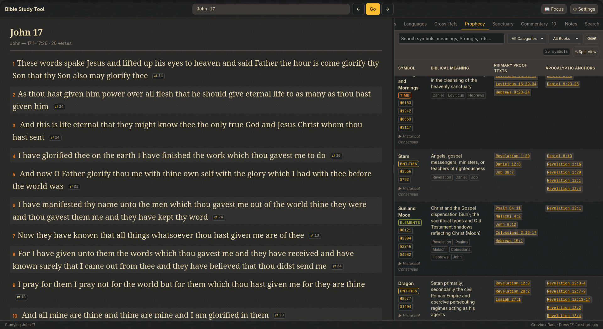
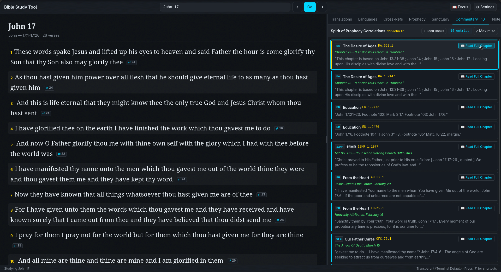

# Visual Tour & Gallery — Adventist Bible Study Tool

  

A visual guide to the research workstations, reading modes, and color palettes available in the **Adventist Bible Study Tool**. Designed with a tranquil, archival "Study Room Desk" aesthetic, every workstation is engineered for deep inductive biblical scholarship with zero external cloud dependencies.

---

## Table of Contents

1. [The Study Room Desk & Original Languages](#1-the-study-room-desk--original-languages)
2. [Unified & Hybrid Semantic Search Engine](#2-unified--hybrid-semantic-search-engine)
3. [Multi-Translation Parallel Reading Desk](#3-multi-translation-parallel-reading-desk)
4. [Interactive Sanctuary Typology Blueprint & Plan of Salvation](#4-interactive-sanctuary-typology-blueprint--plan-of-salvation)
5. [Master Prophetic Key Table & Apocalyptic Symbol Chaining](#5-master-prophetic-key-table--apocalyptic-symbol-chaining)
6. [Spirit of Prophecy Progressive Narrative Reader & Correlations](#6-spirit-of-prophecy-progressive-narrative-reader--correlations)
7. [Focus Mode & Workspace Ergonomics](#7-focus-mode--workspace-ergonomics)
8. [Study Room Themes & Archival Palettes](#8-study-room-themes--archival-palettes)

---

## 1. The Study Room Desk & Original Languages

The default layout pairs a continuous Scripture reading desk on the left (65% width) with the Study Room Inspector on the right (35% width). Clicking any verse or navigating with `j` / `k` instantly synchronizes the original Hebrew and Greek syntax, morphological trees, and theological nuance cards.

### Warm Sepia Theme (Study Room Desk)

*John 17 in the Sepia theme: Scripture reading desk (left) alongside Original Languages & Concordance inspector (right) unpacking Greek verbal aspect and theological nuance in plain English.*

### Dark Walnut Theme (Study Room Night)

*The same passage in the Dark Walnut theme, designed for low-light evening study.*

#### What You See on the Languages Desk:
- **Greek & Hebrew Morphology**: Word-by-word breakdown showing lemma, transliteration, Strong's number (e.g. `G2980`), and full grammatical code (`V-AAI-3S`).
- **Plain-English Theological Nuance**: Explains grammatical weight without seminary jargon. For example, the **Aorist Active Indicative** of *to speak* (λαλέω) is explained as a *Punctiliar / Snapshot Aspect* viewing the action as an accomplished whole ("did / took place once for all"), with the indicative mood establishing objective historical reality.
- **Reciprocal Scripture Links**: Inline verse badges (e.g. `⇄ 24`) indicating the count of reciprocal cross-references linking to other passages in Scripture.

---

## 2. Unified & Hybrid Semantic Search Engine

The Unified Search workstation ([WP-039](wp/WP-039-deterministic-cross-language-unified-search.md), [WP-040](wp/WP-040-neural-embeddings-and-hybrid-search.md), [ADR-029](decisions/ADR-029-zero-pytorch-local-neural-embeddings-and-hybrid-search.md)) searches across all 31,102 verses (KJV), parallel translations (ASV, BSB, YLT), Macula original-language tokens, Ellen G. White commentary, and curated notes with sub-millisecond response times.

### Hybrid Search in Action (Nord Theme)

*Searching `"And all mine are"` across Scripture and commentary with Tri-Brid Reciprocal Rank Fusion.*

#### Key Capabilities:
- **Tri-Brid Reciprocal Rank Fusion (RRF)**: Blends SQLite FTS5 BM25 text rank, local dense vector cosine similarity, and Treasury of Scripture Knowledge (TSK) cross-reference graph into a single unified relevance score.
- **Three Transparent Modes**:
  - `✦ Hybrid` *(Default)*: Blends direct keyword matches, semantic thematic parallels, and cross-references.
  - `Aa Keyword`: 100% deterministic SQLite FTS5 BM25 exact phrase and keyword search.
  - `☵ Thematic`: Pure local vector cosine similarity across 384-dimensional embeddings for conceptual discovery (e.g. *suffering servant*, *messianic sacrifice*, *covenant faithfulness*).
- **Source Filter Pills**: Real-time hit counts across categories (`All 67`, `Scripture 13`, `Translations 8`, `Commentary 50`, `Curated 4`).
- **Zero Cloud / Zero Generative AI**: Runs 100% locally on CPU via quantized ONNX (`multilingual-e5-small`). Pure mathematical vector geometry over pinned Scripture with zero hallucinations.

---

## 3. Multi-Translation Parallel Reading Desk

Comparing parallel translations is essential for discerning translation nuances and grammatical structure. Press **`v`** or click the **Translations** tab to compare four public-domain versions side-by-side or stacked per verse.

### Comparative Reading in Light Paper Theme

*John 17 in the Light Paper (Archival Parchment) theme: KJV, ASV, BSB, and YLT stacked per verse with classical biblical typography.*

#### Translations Bundled:
1. **King James Version (KJV 1769)**: Pinned historical text with Strong's concordance tags.
2. **American Standard Version (ASV 1901)**: Renowned for strict formal grammatical equivalence.
3. **Berean Standard Bible (BSB 2020)**: Clean, modern, and highly readable English.
4. **Young's Literal Translation (YLT 1898)**: Preserves original Hebrew and Greek verbal tenses.

---

## 4. Interactive Sanctuary Typology Blueprint & Plan of Salvation

The Sanctuary is the visual pedagogical model of the entire Plan of Salvation (Psalm 77:13: *"Thy way, O God, is in the sanctuary"*). Press **`z`** to expand the tab into full-panel zoom.

### Full-Screen Sanctuary Blueprint (Tokyo Night Theme)

*Interactive Sanctuary Blueprint floorplan with the 4-stage Plan of Salvation slider in Tokyo Night theme.*

#### Features:
- **Interactive Vector Architecture**:
  - **Courtyard (Earth / Justification)**: Brazen Altar (*Mizbach Ha'olah*) and Bronze Laver (*Kiyyor Nechoshet*).
  - **Holy Place (Heavenly Sanctuary / Daily Sanctification)**: Table of Shewbread (*Lechem Happanim*), Seven-Branched Lampstand (*Menorah*), and Altar of Incense (*Mizbach Haqqetoret*).
  - **Most Holy Place (Heavenly Throne / Yearly Judgment)**: Ark of the Covenant and Mercy Seat (*Aron Habberit*).
- **4-Stage Chronological Plan of Salvation Slider**:
  1. *1. Cross (AD 31)* — **Justification**: Christ the Lamb slain for the sins of the world.
  2. *2. Heavenly Intercession (AD 31–1844)* — **Sanctification**: Daily priestly mediation in the Holy Place.
  3. *3. Investigative Judgment (1844–Close of Probation)* — **Cleansing of the Sanctuary**: Antitypical Day of Atonement (Daniel 8:14, Leviticus 16, Revelation 14:7).
  4. *4. Consummation / New Earth* — **Eternal Restoration**: Eradication of sin and God dwelling forever with His redeemed people (Revelation 21:3).

---

## 5. Master Prophetic Key Table & Apocalyptic Symbol Chaining

The Master Prophetic Key Table ([WP-031](wp/WP-031-master-prophetic-table-and-original-language-nuances.md)) provides a historicist apocalyptic symbol decoder for the prophetic books of Daniel and Revelation.

### Split-Screen View (Gruvbox Dark Theme)

*Prophetic Key Table in split-screen view: symbols for Evening & Morning (TIME), Stars, Sun and Moon, and Dragon with Old Testament primary proof texts.*

### Full Panel Zoom View (Gruvbox Dark Theme)

*Prophetic Key Table in full panel zoom (`z`): Crowns, Mark of the Beast vs. Seal of God, Wine of Babylon, Two Witnesses, Candlestick, Incense, Locusts, and Trumpets.*

#### Capabilities:
- **25+ Curated Apocalyptic Symbols**: Each symbol is grounded in original Hebrew and Greek roots, primary Old Testament proof texts, and apocalyptic anchors in Daniel and Revelation.
- **Categorical Filtering**: Filter by category (`Time`, `Entities`, `Elements`, `Actions`, `Objects`) or book of interest.
- **Historical Consensus Citations**: Inspect historical interpretations across classical Adventist and Protestant historicist scholarship.

---

## 6. Spirit of Prophecy Progressive Narrative Reader & Correlations

For deep contextual study of the Spirit of Prophecy, the Commentary tab pairs direct Scripture cross-references with a progressive, chapter-by-chapter narrative reader ([WP-033](wp/WP-033-progressive-spirit-of-prophecy-chapter-reader.md)).

### Chapter Reader Drawer (Dracula Theme)

*Narrative Reader drawer displaying Chapter 73 ("Let Not Your Heart Be Troubled") of The Desire of Ages (DA) with physical book pagination (DA 662.1).*

### Verse Correlations List (Transparent Theme)

*Correlations list for John 17 in Transparent theme: cards for The Desire of Ages, Education, 12MR, From the Heart, and Our Father Cares with "Read Full Chapter" action buttons.*

#### Capabilities:
- **Physical Book Pagination Fidelity**: Matches the printed book page and paragraph numbering (e.g. `DA 662.1`, `PP 44.1`, `GC 623.2`) used across academic and church scholarship.
- **Sequential Traversal**: Traverse entire chapters sequentially with `‹ Prev` and `Next ›` buttons.
- **Direct Citation Jumps**: Click any correlation card to slide open the reading drawer directly to that paragraph.

---

## 7. Focus Mode & Workspace Ergonomics

The application includes thoughtful ergonomic tools to accommodate hours of focused, distraction-free study:

### Distraction-Free Focus Mode (`f`)

*Pressing 'f' hides the Study Inspector and expands Scripture reading to the full window width.*

#### Ergonomic Controls:
- **Focus Mode (`f` or button)**: Expands the Scripture reading desk to full width. Press `f` or `Esc` to restore panels.
- **Panel Zoom (`z` or `Shift+F`)**: Maximizes any study panel (Sanctuary, Prophecy, Commentary, Search) to full width.
- **Content Font Size Scaling (`+` / `-` / `0`)**: Scale biblical and commentary text size from 80% to 160% without enlarging UI buttons or menus.
- **Draggable Split-Pane**: Adjust reading vs research balance; double-click the divider handle to reset to 65/35.
- **Keyboard Shortcut Help (`?`)**: Press `?` anytime to display the complete shortcut reference table.

---

## 8. Study Room Themes & Archival Palettes

The workstation provides 10 carefully balanced, WCAG AAA compliant color palettes. Press **`t`** to cycle themes instantly:

| Theme | Inspiration | Ideal Lighting |
| :--- | :--- | :--- |
| **Warm Sepia** | Classic study desk, parchment, archival library | Daylight & warm lamps |
| **Dark Walnut** | Dark stained walnut library desk *(Default)* | Evening & dim rooms |
| **Light Paper** | Crisp, clean archival book paper | Bright daylight study |
| **Nord** | Arctic cool, serene slate blue and ice | Modern minimalist rooms |
| **Tokyo Night** | Deep navy with neon accent highlights | Late night deep work |
| **Gruvbox Dark** | Retro warm contrast with earthy tones | Long reading sessions |
| **Dracula** | Vibrant high-contrast dark palette | High visual contrast |
| **Catppuccin Mocha** | Soothing pastel dark palette | Soft, gentle reading |
| **Solarized Dark** | Scientifically calibrated low-glare dark | Low eye fatigue |
| **Transparent** | Terminal background pass-through | Embedded / SSH workflows |

---

> 📖 **Ready to begin studying?**  
> Check out the [Downloads Guide](DOWNLOADS.md) to install the desktop application, or read the [User & Study Guide](USER_GUIDE.md) and [How to Study the Bible](HOW_TO_STUDY_THE_BIBLE.md) for inductive study tutorials.
